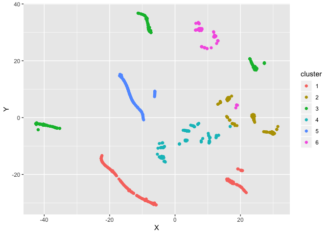

Mixed Clustering
================
Arunav Saikia

<h2>

Getting Ready

</h2>

**Set working directory**

``` r
setwd("/Users/arunavsaikia/Documents/GitHub/NLP-Yelp-Restaurants/Restaurant Clustering/")
```

**Explore the data**

Read data and cast variables appropriately. The different data types are
:

  - Continuous
  - Ordinal
  - Nominal

<!-- end list -->

``` r
df <- read.csv('../data/clusteringAD_new.csv')
df_subset <- df[,c(37,38,39,40)]
df_subset$rating <- as.ordered(df_subset$rating)
df_subset$expensivenss <- as.ordered(df_subset$expensivenss)
df_subset$cuisines <- as.ordered(df_subset$cuisines)
summary(df_subset)
```

    ##  cuisines     review           rating    expensivenss
    ##  1:500    Min.   :  52.0   3.5    :357   1: 89       
    ##  2:253    1st Qu.:  88.5   4      :313   2:697       
    ##  3:137    Median : 131.0   3      :167   3:132       
    ##  4: 41    Mean   : 185.9   2.5    : 45   4: 17       
    ##  5:  4    3rd Qu.: 214.5   4.5    : 44               
    ##           Max.   :2712.0   2      :  5               
    ##                            (Other):  4

<h2>

Calculating Distance Metric

</h2>

**Gower Distance**

In order for a yet-to-be-chosen algorithm to group observations
together, we first need to define some notion of (dis)similarity between
observations. A popular choice for clustering is Euclidean distance.
However, Euclidean distance is only valid for continuous variables, and
thus is not applicable here. In order for a clustering algorithm to
yield sensible results, we have to use a distance metric that can handle
mixed data types. In this case, we will use something called Gower
distance.\[1\]

Concept of Gower distance - For each variable type, a particular
distance metric that works well for that type is used and scaled to fall
between 0 and 1.

``` r
library(cluster) 
gower.dist <- daisy(df_subset, metric = c("gower"))
summary(gower.dist)
```

    ## 436645 dissimilarities, summarized :
    ##    Min. 1st Qu.  Median    Mean 3rd Qu.    Max. 
    ## 0.00000 0.08446 0.13825 0.14818 0.20113 0.65194 
    ## Metric :  mixed ;  Types = O, I, O, O 
    ## Number of objects : 935

**Look at similar/dissimilar restaurants**

As a sanity check, to make sure the metric is working, we can check the
most similar and dissimilar pairs in terms of the Gower distance.
Similar pairs will have similar features and for pairs which are
dissimilar the features will be completely different

``` r
gower_mat <- as.matrix(gower.dist)

# Output most similar pair

df_subset[
  which(gower_mat == min(gower_mat[gower_mat != min(gower_mat)]),
        arr.ind = TRUE)[1, ], ]
```

    ##     cuisines review rating expensivenss
    ## 583        3    161    2.5            2
    ## 18         3    160    2.5            2

``` r
# Output most dissimilar pair

df_subset[
  which(gower_mat == max(gower_mat[gower_mat != max(gower_mat)]),
        arr.ind = TRUE)[1, ], ]
```

    ##     cuisines review rating expensivenss
    ## 757        3    156      3            4
    ## 564        1   2712    4.5            2

<h2>

Algorithm 1 - Partitioning Around Medoids

</h2>

***What is PAM?***

Partitioning around medoids is an iterative clustering procedure with
the following steps:

  - Choose k random entities to become the mediods
  - Assign every entity to its closest medoid (using our custom distance
    matrix in this case)
  - For each cluster, identify the observation that would yield the
    lowest average distance if it were to be re-assigned as the medoid.
    If so, make this observation the new medoid.
  - If at least one medoid has changed, return to step 2. Otherwise, end
    the algorithm.

Both k-means and k-medoids approaches are identical, except k-means has
cluster centers defined by Euclidean distance (i.e., centroids), while
cluster centers for PAM are restricted to be the observations themselves
(i.e., medoids).

***Silhouette Analysis***

We then look at the silhouette width - a validation metric which is an
aggregated measure of how similar an observation is to its own cluster
compared its closest neighboring cluster. The metric can range from -1
to 1, where higher values are better.

Increasing number of clusters will almost always lead to better
silhouette score, but that does not make sense or satisfy the objective.
Long story short, we should pick a meaningful number that is simple and
equally as good.

``` r
max_clusters <- 20
sil_width <- c(NA)

for(i in 2:max_clusters){
  
  pam_fit <- pam(gower.dist,
                 diss = TRUE,
                 k = i)
  
  sil_width[i] <- pam_fit$silinfo$avg.width
  
}

# Plot sihouette width (higher is better)

plot(1:max_clusters, sil_width,
     xlab = "Number of clusters",
     ylab = "Silhouette Width")
lines(1:max_clusters, sil_width)
```

<!-- -->

***Cluster Interpretation via descriptive statistics***

After running the algorithm and selecting 7 clusters, we can interpret
the clusters by running summary on each cluster.

``` r
library(dplyr)
```

    ## 
    ## Attaching package: 'dplyr'

    ## The following objects are masked from 'package:stats':
    ## 
    ##     filter, lag

    ## The following objects are masked from 'package:base':
    ## 
    ##     intersect, setdiff, setequal, union

``` r
num_clusters = 7
pam_fit <- pam(gower.dist,
                 diss = TRUE,
                 k = num_clusters)

pam_results <- df_subset %>%
  mutate(cluster = pam_fit$clustering) %>%
  group_by(cluster) %>%
  do(the_summary = summary(.))

pam_results$the_summary
```

    ## [[1]]
    ##  cuisines     review           rating    expensivenss    cluster 
    ##  1:234    Min.   : 52.00   3.5    :157   1:  0        Min.   :1  
    ##  2:  0    1st Qu.: 85.25   3      : 60   2:234        1st Qu.:1  
    ##  3:  0    Median :117.00   2.5    : 15   3:  0        Median :1  
    ##  4:  0    Mean   :163.17   1.5    :  1   4:  0        Mean   :1  
    ##  5:  0    3rd Qu.:200.25   2      :  1                3rd Qu.:1  
    ##           Max.   :941.00   4      :  0                Max.   :1  
    ##                            (Other):  0                           
    ## 
    ## [[2]]
    ##  cuisines     review           rating   expensivenss    cluster 
    ##  1:  0    Min.   :  53.0   3.5    :61   1:  6        Min.   :2  
    ##  2:  0    1st Qu.: 102.5   3      :44   2:140        1st Qu.:2  
    ##  3:126    Median : 152.0   4      :36   3: 20        Median :2  
    ##  4: 37    Mean   : 200.0   2.5    :18   4:  1        Mean   :2  
    ##  5:  4    3rd Qu.: 237.5   4.5    : 4                3rd Qu.:2  
    ##           Max.   :1587.0   2      : 3                Max.   :2  
    ##                            (Other): 1                           
    ## 
    ## [[3]]
    ##  cuisines     review          rating   expensivenss    cluster 
    ##  1:  0    Min.   : 55.0   3.5    :72   1:  9        Min.   :3  
    ##  2:193    1st Qu.: 83.0   4      :61   2:184        1st Qu.:3  
    ##  3:  0    Median :119.0   3      :47   3:  0        Median :3  
    ##  4:  0    Mean   :159.9   2.5    :10   4:  0        Mean   :3  
    ##  5:  0    3rd Qu.:174.0   4.5    : 2                3rd Qu.:3  
    ##           Max.   :907.0   1.5    : 1                Max.   :3  
    ##                           (Other): 0                           
    ## 
    ## [[4]]
    ##  cuisines     review          rating   expensivenss    cluster 
    ##  1: 0     Min.   : 63.0   4      :38   1: 0         Min.   :4  
    ##  2:54     1st Qu.:109.0   3.5    :20   2: 0         1st Qu.:4  
    ##  3:11     Median :166.0   3      : 5   3:57         Median :4  
    ##  4: 4     Mean   :225.4   4.5    : 5   4:12         Mean   :4  
    ##  5: 0     3rd Qu.:265.0   2.5    : 1                3rd Qu.:4  
    ##           Max.   :853.0   1.5    : 0                Max.   :4  
    ##                           (Other): 0                           
    ## 
    ## [[5]]
    ##  cuisines     review           rating    expensivenss    cluster 
    ##  1:139    Min.   :  53.0   4      :119   1:  0        Min.   :5  
    ##  2:  0    1st Qu.:  94.0   4.5    : 20   2:139        1st Qu.:5  
    ##  3:  0    Median : 143.0   1.5    :  0   3:  0        Median :5  
    ##  4:  0    Mean   : 230.4   2      :  0   4:  0        Mean   :5  
    ##  5:  0    3rd Qu.: 255.5   2.5    :  0                3rd Qu.:5  
    ##           Max.   :2712.0   3      :  0                Max.   :5  
    ##                            (Other):  0                           
    ## 
    ## [[6]]
    ##  cuisines     review          rating   expensivenss    cluster 
    ##  1:59     Min.   : 61.0   3.5    :26   1: 0         Min.   :6  
    ##  2: 0     1st Qu.:113.5   4      :24   2: 0         1st Qu.:6  
    ##  3: 0     Median :160.0   4.5    : 6   3:55         Median :6  
    ##  4: 0     Mean   :204.8   3      : 2   4: 4         Mean   :6  
    ##  5: 0     3rd Qu.:222.5   2.5    : 1                3rd Qu.:6  
    ##           Max.   :890.0   1.5    : 0                Max.   :6  
    ##                           (Other): 0                           
    ## 
    ## [[7]]
    ##  cuisines     review            rating   expensivenss    cluster 
    ##  1:68     Min.   :  57.00   4      :35   1:74         Min.   :7  
    ##  2: 6     1st Qu.:  74.25   3.5    :21   2: 0         1st Qu.:7  
    ##  3: 0     Median :  98.00   3      : 9   3: 0         Median :7  
    ##  4: 0     Mean   : 158.19   4.5    : 7   4: 0         Mean   :7  
    ##  5: 0     3rd Qu.: 141.75   2      : 1                3rd Qu.:7  
    ##           Max.   :1279.00   5      : 1                Max.   :7  
    ##                             (Other): 0

***Visualizing the clusters***

Although not perfect, colors are mostly located in similar areas,
confirming the relevancy of the segmentation

``` r
library(Rtsne)
library(ggplot2)
library(dplyr)


tsne_obj <- Rtsne(gower.dist, is_distance = TRUE)

tsne_data <- tsne_obj$Y %>%
  data.frame() %>%
  setNames(c("X", "Y")) %>%
  mutate(cluster = factor(pam_fit$clustering),
         name = df_subset$name)

ggplot(aes(x = X, y = Y), data = tsne_data) +
  geom_point(aes(color = cluster))
```

<!-- -->

<h2>

Algorithm 2 - Hierarchical Clustering

</h2>

**What is Hierarchical Clustering?**

1.  ***Agglomerative clustering***: Also known as **AGNES (Agglomerative
    Nesting)** works in a bottom-up manner. Each object is initially
    considered as a single-element cluster (leaf). At each step of the
    algorithm, the two clusters that are the most similar are combined
    into a new bigger cluster (nodes). This procedure is iterated until
    all points are member of just one single big cluster (root) (see
    figure below)

2.  ***Divisive hierarchical clustering***: It’s also known as **DIANA
    (Divise Analysis)** and it works in a top-down manner. The algorithm
    is an inverse order of AGNES. It begins with the root, in which all
    objects are included in a single cluster. At each step of iteration,
    the most heterogeneous cluster is divided into two. The process is
    iterated until all objects are in their own cluster (see figure
    below).


***Agglomerative clustering is good at identifying small clusters.
Divisive hierarchical clustering is good at identifying large
clusters.***

``` r
#------------ DIVISIVE CLUSTERING ------------#
divisive.clust <- diana(gower.dist, 
                  diss = TRUE, keep.diss = FALSE)
divisive.clust$dc
```

    ## [1] 0.9920504

``` r
pltree(divisive.clust, main = "Divisive")
```

<!-- -->

``` r
#------------ AGGLOMERATIVE CLUSTERING ------------#
# “complete”, “average”, “single”, “ward.D”
par(mfrow=c(2,2))
aggl.clust.c <- hclust(gower.dist, method = "complete")
aggl.clust.a <- hclust(gower.dist, method = "average")
aggl.clust.s <- hclust(gower.dist, method = "single")
aggl.clust.w <- hclust(gower.dist, method = "ward.D")
plot(aggl.clust.c,
     main = "Agglomerative, complete linkages")
plot(aggl.clust.a,
     main = "Agglomerative, average linkages")
plot(aggl.clust.s,
     main = "Agglomerative, single linkages")
plot(aggl.clust.w,
     main = "Agglomerative, ward linkages")
```

<!-- -->

**Assess strength of the clusters**

We can also get the agglomerative coefficient, which measures the amount
of clustering structure found (values closer to 1 suggest strong
clustering structure).

``` r
library(purrr)
m <- c( "average", "single", "complete", "ward")
names(m) <- c( "average", "single", "complete", "ward")

# function to compute coefficient
ac <- function(x) {
  agnes(gower.dist, diss = TRUE, method = x)$ac
}

map(m, ac)
```

    ## $average
    ## [1] 0.9860011
    ## 
    ## $single
    ## [1] 0.978832
    ## 
    ## $complete
    ## [1] 0.9936436
    ## 
    ## $ward
    ## [1] 0.9984664

**Working with Dendograms**

``` r
sub_grp <- cutree(aggl.clust.w, k = 6)
plot(aggl.clust.w, cex = 0.6)
rect.hclust(aggl.clust.w, k = 6, border = 1:6)
```

<!-- -->

**Visualize results in 2D**

``` r
tsne_obj <- Rtsne(gower.dist, is_distance = TRUE)

tsne_data <- tsne_obj$Y %>%
  data.frame() %>%
  setNames(c("X", "Y")) %>%
  mutate(cluster = factor(sub_grp),
         name = df_subset$name)

ggplot(aes(x = X, y = Y), data = tsne_data) +
  geom_point(aes(color = cluster))
```

<!-- -->

**Cluster Interpretation** Lets try to interpret the clusters in terms
of descriptive statistics

``` r
algo_results <- df_subset %>%
  mutate(cluster = sub_grp) %>%
  group_by(cluster) %>%
  do(the_summary = summary(.))

algo_results$the_summary
```

    ## [[1]]
    ##  cuisines     review           rating    expensivenss    cluster 
    ##  1:234    Min.   : 52.00   3.5    :157   1:  0        Min.   :1  
    ##  2:  0    1st Qu.: 85.25   3      : 60   2:234        1st Qu.:1  
    ##  3:  0    Median :117.00   2.5    : 15   3:  0        Median :1  
    ##  4:  0    Mean   :163.17   1.5    :  1   4:  0        Mean   :1  
    ##  5:  0    3rd Qu.:200.25   2      :  1                3rd Qu.:1  
    ##           Max.   :941.00   4      :  0                Max.   :1  
    ##                            (Other):  0                           
    ## 
    ## [[2]]
    ##  cuisines     review           rating   expensivenss    cluster 
    ##  1:  0    Min.   :  53.0   3.5    :43   1:  1        Min.   :2  
    ##  2:  0    1st Qu.: 101.0   4      :36   2:138        1st Qu.:2  
    ##  3:108    Median : 152.0   3      :35   3:  0        Median :2  
    ##  4: 31    Mean   : 206.0   2.5    :18   4:  0        Mean   :2  
    ##  5:  0    3rd Qu.: 236.5   4.5    : 4                3rd Qu.:2  
    ##           Max.   :1587.0   2      : 2                Max.   :2  
    ##                            (Other): 1                           
    ## 
    ## [[3]]
    ##  cuisines     review          rating   expensivenss    cluster 
    ##  1:  0    Min.   : 55.0   3.5    :66   1:  0        Min.   :3  
    ##  2:184    1st Qu.: 87.0   4      :61   2:184        1st Qu.:3  
    ##  3:  0    Median :120.0   3      :45   3:  0        Median :3  
    ##  4:  0    Mean   :161.8   2.5    :10   4:  0        Mean   :3  
    ##  5:  0    3rd Qu.:185.2   4.5    : 2                3rd Qu.:3  
    ##           Max.   :907.0   1.5    : 0                Max.   :3  
    ##                           (Other): 0                           
    ## 
    ## [[4]]
    ##  cuisines     review          rating   expensivenss    cluster 
    ##  1:59     Min.   : 61.0   3.5    :63   1:  0        Min.   :4  
    ##  2:54     1st Qu.:112.0   4      :62   2:  2        1st Qu.:4  
    ##  3:25     Median :166.0   3      :12   3:132        Median :4  
    ##  4: 9     Mean   :211.1   4.5    :11   4: 17        Mean   :4  
    ##  5: 4     3rd Qu.:250.0   2.5    : 2                3rd Qu.:4  
    ##           Max.   :890.0   2      : 1                Max.   :4  
    ##                           (Other): 0                           
    ## 
    ## [[5]]
    ##  cuisines     review           rating    expensivenss    cluster 
    ##  1:139    Min.   :  53.0   4      :119   1:  0        Min.   :5  
    ##  2:  0    1st Qu.:  94.0   4.5    : 20   2:139        1st Qu.:5  
    ##  3:  0    Median : 143.0   1.5    :  0   3:  0        Median :5  
    ##  4:  0    Mean   : 230.4   2      :  0   4:  0        Mean   :5  
    ##  5:  0    3rd Qu.: 255.5   2.5    :  0                3rd Qu.:5  
    ##           Max.   :2712.0   3      :  0                Max.   :5  
    ##                            (Other):  0                           
    ## 
    ## [[6]]
    ##  cuisines     review           rating   expensivenss    cluster 
    ##  1:68     Min.   :  57.0   4      :35   1:88         Min.   :6  
    ##  2:15     1st Qu.:  73.0   3.5    :28   2: 0         1st Qu.:6  
    ##  3: 4     Median :  98.0   3      :15   3: 0         Median :6  
    ##  4: 1     Mean   : 151.5   4.5    : 7   4: 0         Mean   :6  
    ##  5: 0     3rd Qu.: 140.2   1.5    : 1                3rd Qu.:6  
    ##           Max.   :1279.0   2      : 1                Max.   :6  
    ##                            (Other): 1

<h2>

Final Comments

</h2>

<h2>

References

</h2>

1.  <https://www.r-bloggers.com/clustering-mixed-data-types-in-r/>
2.  <https://towardsdatascience.com/hierarchical-clustering-on-categorical-data-in-r-a27e578f2995>
