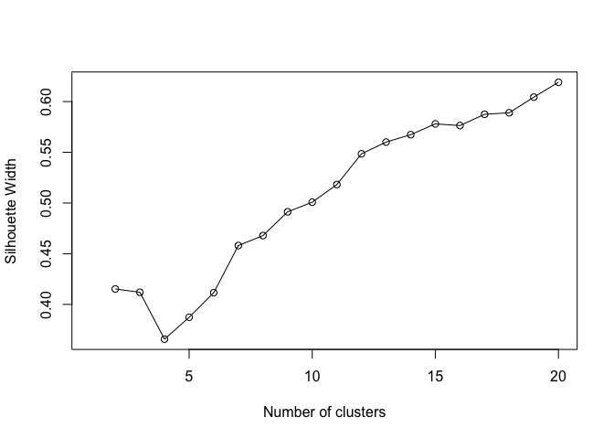
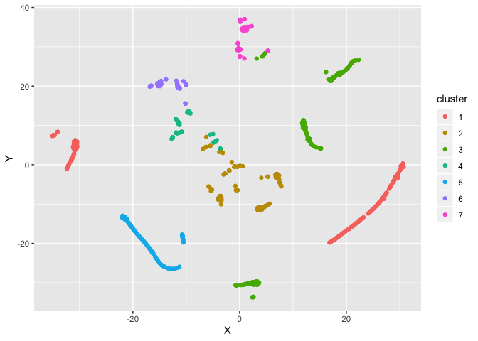
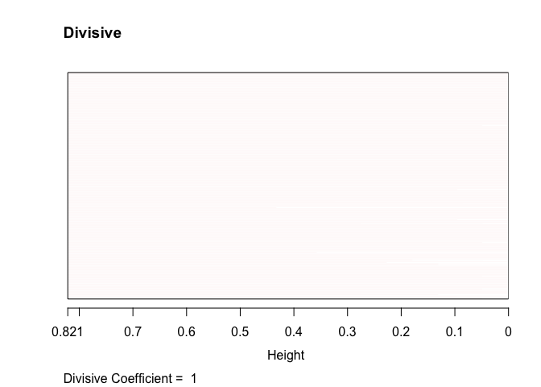
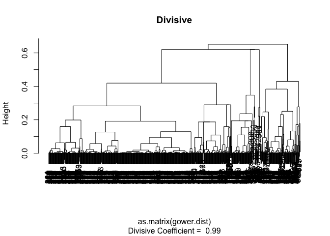
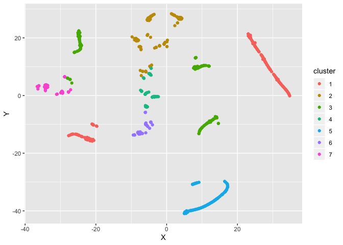

R Notebook
================

**Set working directory**

``` r
setwd("/Users/arunavsaikia/Documents/GitHub/NLP-Yelp-Restaurants/Restaurant Clustering/")
```

<h2>

Getting Ready

</h2>

**Explore the data**

Read data and cast variables appropriately. The different data types are
:

  - Continuous
  - Ordinal
  - Nominal

<!-- end list -->

``` r
df <- read.csv('../data/clusteringAD_new.csv')
df_subset <- df[,c(37,39,40)]
df_subset$rating <- as.ordered(df_subset$rating)
df_subset$expensivenss <- as.ordered(df_subset$expensivenss)
summary(df_subset)
```

    ##     cuisines         rating    expensivenss
    ##  Min.   :1.000   3.5    :357   1: 89       
    ##  1st Qu.:1.000   4      :313   2:697       
    ##  Median :1.000   3      :167   3:132       
    ##  Mean   :1.712   2.5    : 45   4: 17       
    ##  3rd Qu.:2.000   4.5    : 44               
    ##  Max.   :5.000   2      :  5               
    ##                  (Other):  4

<h2>

Calculating Distance Metric

</h2>

**Gower Distance**

In order for a yet-to-be-chosen algorithm to group observations
together, we first need to define some notion of (dis)similarity between
observations. A popular choice for clustering is Euclidean distance.
However, Euclidean distance is only valid for continuous variables, and
thus is not applicable here. In order for a clustering algorithm to
yield sensible results, we have to use a distance metric that can handle
mixed data types. In this case, we will use something called Gower
distance.\[1\]

Concept of Gower distance - For each variable type, a particular
distance metric that works well for that type is used and scaled to fall
between 0 and 1.

``` r
library(cluster) 
gower.dist <- daisy(df_subset, metric = c("gower"))
summary(gower.dist)
```

    ## 436645 dissimilarities, summarized :
    ##    Min. 1st Qu.  Median    Mean 3rd Qu.    Max. 
    ## 0.00000 0.09524 0.16667 0.17931 0.24206 0.82143 
    ## Metric :  mixed ;  Types = I, O, O 
    ## Number of objects : 935

**Look at similar/dissimilar restaurants**

As a sanity check, to make sure the metric is working, we can check the
most similar and dissimilar pairs in terms of the Gower distance.
Similar pairs will have similar features and for pairs which are
dissimilar the features will be completely different

``` r
gower_mat <- as.matrix(gower.dist)

# Output most similar pair

df_subset[
  which(gower_mat == min(gower_mat[gower_mat != min(gower_mat)]),
        arr.ind = TRUE)[1, ], ]
```

    ##     cuisines rating expensivenss
    ## 157        3    4.5            2
    ## 2          3      4            2

``` r
# Output most dissimilar pair

df_subset[
  which(gower_mat == max(gower_mat[gower_mat != max(gower_mat)]),
        arr.ind = TRUE)[1, ], ]
```

    ##     cuisines rating expensivenss
    ## 830        2    1.5            1
    ## 563        4    4.5            4

<h2>

Algorithm 1 - Partitioning Around Medoids

</h2>

***What is PAM?***

Partitioning around medoids is an iterative clustering procedure with
the following steps:

  - Choose k random entities to become the mediods
  - Assign every entity to its closest medoid (using our custom distance
    matrix in this case)
  - For each cluster, identify the observation that would yield the
    lowest average distance if it were to be re-assigned as the medoid.
    If so, make this observation the new medoid.
  - If at least one medoid has changed, return to step 2. Otherwise, end
    the algorithm.

Both k-means and k-medoids approaches are identical, except k-means has
cluster centers defined by Euclidean distance (i.e., centroids), while
cluster centers for PAM are restricted to be the observations themselves
(i.e., medoids).

***Silhouette Analysis***

We then look at the silhouette width - a validation metric which is an
aggregated measure of how similar an observation is to its own cluster
compared its closest neighboring cluster. The metric can range from -1
to 1, where higher values are better.

``` r
max_clusters <- 20
sil_width <- c(NA)

for(i in 2:max_clusters){
  
  pam_fit <- pam(gower.dist,
                 diss = TRUE,
                 k = i)
  
  sil_width[i] <- pam_fit$silinfo$avg.width
  
}

# Plot sihouette width (higher is better)

plot(1:max_clusters, sil_width,
     xlab = "Number of clusters",
     ylab = "Silhouette Width")
lines(1:max_clusters, sil_width)
```

<!-- -->
***Cluster Interpretation via descriptive statistics***

After running the algorithm and selecting 7 clusters, we can interpret
the clusters by running summary on each cluster.

``` r
library(dplyr)
```

    ## 
    ## Attaching package: 'dplyr'

    ## The following objects are masked from 'package:stats':
    ## 
    ##     filter, lag

    ## The following objects are masked from 'package:base':
    ## 
    ##     intersect, setdiff, setequal, union

``` r
num_clusters = 3
pam_fit <- pam(gower.dist,
                 diss = TRUE,
                 k = num_clusters)

pam_results <- df_subset %>%
  dplyr::select(1,2,3) %>%
  mutate(cluster = pam_fit$clustering) %>%
  group_by(cluster) %>%
  do(the_summary = summary(.))

pam_results$the_summary
```

    ## [[1]]
    ##     cuisines     rating    expensivenss    cluster 
    ##  Min.   :1   3.5    :204   1: 68        Min.   :1  
    ##  1st Qu.:1   4      :172   2:373        1st Qu.:1  
    ##  Median :1   3      : 71   3: 55        Median :1  
    ##  Mean   :1   4.5    : 33   4:  4        Mean   :1  
    ##  3rd Qu.:1   2.5    : 16                3rd Qu.:1  
    ##  Max.   :1   2      :  2                Max.   :1  
    ##              (Other):  2                           
    ## 
    ## [[2]]
    ##     cuisines         rating   expensivenss    cluster 
    ##  Min.   :3.000   3.5    :61   1:  6        Min.   :2  
    ##  1st Qu.:3.000   4      :48   2:140        1st Qu.:2  
    ##  Median :3.000   3      :44   3: 32        Median :2  
    ##  Mean   :3.269   2.5    :18   4:  4        Mean   :2  
    ##  3rd Qu.:3.000   4.5    : 7                3rd Qu.:2  
    ##  Max.   :5.000   2      : 3                Max.   :2  
    ##                  (Other): 1                           
    ## 
    ## [[3]]
    ##     cuisines     rating   expensivenss    cluster 
    ##  Min.   :2   4      :93   1: 15        Min.   :3  
    ##  1st Qu.:2   3.5    :92   2:184        1st Qu.:3  
    ##  Median :2   3      :52   3: 45        Median :3  
    ##  Mean   :2   2.5    :11   4:  9        Mean   :3  
    ##  3rd Qu.:2   4.5    : 4                3rd Qu.:3  
    ##  Max.   :2   1.5    : 1                Max.   :3  
    ##              (Other): 0

***Visualizing the clusters***

``` r
library(Rtsne)
library(ggplot2)
library(dplyr)


tsne_obj <- Rtsne(gower.dist, is_distance = TRUE)

tsne_data <- tsne_obj$Y %>%
  data.frame() %>%
  setNames(c("X", "Y")) %>%
  mutate(cluster = factor(pam_fit$clustering),
         name = df_subset$name)

ggplot(aes(x = X, y = Y), data = tsne_data) +
  geom_point(aes(color = cluster))
```

<!-- -->
**Hierarchical Clustering - Divisive & Agglomerative**

``` r
#------------ DIVISIVE CLUSTERING ------------#
divisive.clust <- diana(as.matrix(gower.dist), 
                  diss = TRUE, keep.diss = TRUE)
plot(divisive.clust, main = "Divisive")
```

<!-- --><!-- -->

``` r
#------------ AGGLOMERATIVE CLUSTERING ------------#
# complete
aggl.clust.c <- hclust(gower.dist, method = "complete")
plot(aggl.clust.c,
     main = "Agglomerative, complete linkages")
```

<!-- -->

<h2>

References

</h2>

1.  <https://www.r-bloggers.com/clustering-mixed-data-types-in-r/>
